# Red Hat Microsweeper Demo with Quarkus on Red Hat OpenShift Service on AWS (ROSA)

This demo uses a number of cloud technologies to implement a simple game from the earlier days of computing: Minesweeper!

Watch the demo video that walks you through the instructions step by step:

[](https://youtu.be/UBDzHnDjc_g "Microsweeper Demo with Quarkus on  Red Hat OpenShift Service on AWS")

# Table of Contents

1. [Test your Quarkus App Locally](#TestApplicationLocally)
2. [Deploy the Quarkus App to Red Hat OpenShift Service on AWS](#DeployQuarkusApp)
3. [Integrate with Amazon Simple Email Service](#SendSES)

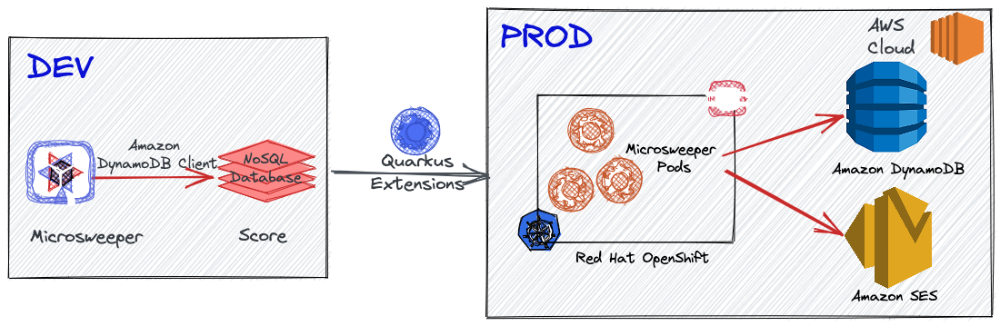

Technologies include:

* JQuery-based Minesweeper written by [Nick Arocho](http://www.nickarocho.com/) and [available on GitHub](https://github.com/nickarocho/minesweeper).
* Backend based on [Quarkus](https://quarkus.io) to persist scoreboard and provide a reactive frontend and backend connected to `NoSQL` database.
* Application deployment on [ Red Hat OpenShift Service on AWS (ROSA)](https://cloud.redhat.com/products/amazon-openshift)
* Datastore to store scores on [Amazon DynamoDB](https://aws.amazon.com/dynamodb) 
* Flexible and highly-scalable email service using [Amazon Simple Email Service (SES)](https://aws.amazon.com/ses)

## 1. Test your Quarkus App Locally<a name="TestApplicationLocally"></a>

### Set up DynamoDB local

There're several ways for developers to set up the DynamoDB locally. In this demo, you can spin the local DynamoDB up quickly using a container. Run the following command:

```shell
docker run --publish 8000:8000 amazon/dynamodb-local:1.11.477 -jar DynamoDBLocal.jar -inMemory -sharedDb
```

The output should look like this:

```shell
Initializing DynamoDB Local with the following configuration:
Port:	8000
InMemory:	true
DbPath:	null
SharedDb:	true
shouldDelayTransientStatuses:	false
CorsParams:	*
```

Find more options how to set up **DynamoDB Local** [here](https://docs.aws.amazon.com/amazondynamodb/latest/developerguide/DynamoDBLocal.html).

When the DynamoDB gets started locally, it's empty database. Let's make sure if there's no tables in your local DynamoDB using the following[ AWS Command Line Interface (CLI)](https://docs.aws.amazon.com/cli/latest/userguide/getting-started-install.html):

```shell
aws dynamodb list-tables --endpoint-url http://localhost:8000
```

The output should look like this:

```shell
{
    "TableNames": []
}
```

Press `q` to return the terminal.

Access the DynamoDB web shell by http://localhost:8000/shell in your web browser. Then, create a new table (**score**) in the DynamoDB Local by copying and pasting the following code to the shell and run it:

```shell
var params = {
    TableName: 'score',
    KeySchema: [{ AttributeName: 'name', KeyType: 'HASH' }],
    AttributeDefinitions: [{  AttributeName: 'name', AttributeType: 'S', }],
    ProvisionedThroughput: { ReadCapacityUnits: 1, WriteCapacityUnits: 1, }
};

dynamodb.createTable(params, function(err, data) {
    if (err) ppJson(err);
    else ppJson(data);

});
```

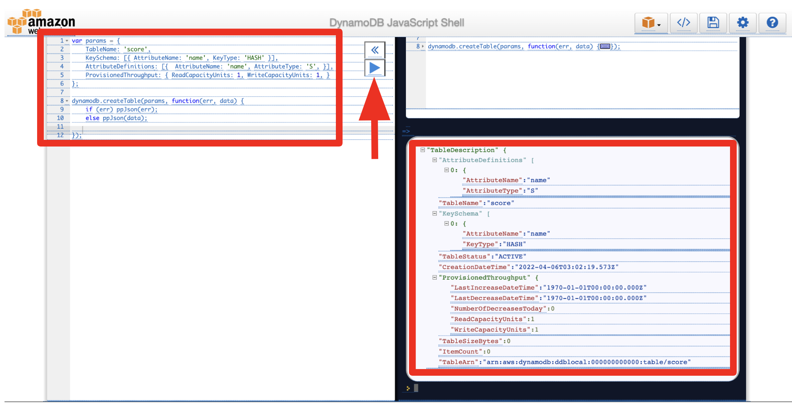

You can also see the table (**score**) when you rerun the `aws dynamodb list-tables` command:

```shell
{
    "TableNames": [
        "score"
    ]
}
```

### Run the Quarkus Live Coding

**quarkus:dev** runs Quarkus in development mode. This enables live reload with background compilation, which means that when you modify your Java files and/or your resource files and refresh your browser, these changes will automatically take effect. This works too for resource files like the configuration property file. Refreshing the browser triggers a scan of the workspace, and if any changes are detected, the Java files are recompiled and the application is redeployed; your request is then serviced by the redeployed application. If there are any issues with compilation or deployment an error page will let you know.

This will also listen for a debugger on port 5005. If you want to wait for the debugger to attach before running you can pass _-Dsuspend_ on the command line. If you don’t want the debugger at all you can use _-Ddebug=false_.

Quarkus also provides a command line interface (CLI) for developers to create projects, manage extensions and do essential build and dev commands using the underlying project build tool. Find the installation document [here](https://quarkus.io/guides/cli-tooling).

Run the following command line to start Quarkus dev mode:


```
quarkus dev
```

_Note_ that you can also use _Maven_ command line interface (_mvn quarkus:dev_).

The output should look like:

```shell
__  ____  __  _____   ___  __ ____  ______ 
 --/ __ \/ / / / _ | / _ \/ //_/ / / / __/ 
 -/ /_/ / /_/ / __ |/ , _/ ,< / /_/ /\ \   
--\___\_\____/_/ |_/_/|_/_/|_|\____/___/   
INFO  [io.quarkus] (Quarkus Main Thread) microsweeper-appservice 1.0.0-SNAPSHOT on JVM (powered by Quarkus xx.xx.xx) started in 2.764s. Listening on: http://localhost:8080

INFO  [io.quarkus] (Quarkus Main Thread) Profile dev activated. Live Coding activated.
INFO  [io.quarkus] (Quarkus Main Thread) Installed features: [amazon-dynamodb, amazon-ses, cdi, kubernetes, resteasy-reactive, resteasy-reactive-jackson, smallrye-context-propagation, vertx]

--
Tests paused
Press [r] to resume testing, [o] Toggle test output, [:] for the terminal, [h] for more options>
```

Press `w` key on the terminal where Quarkus dev mode is running. Then, it will automatically open a web browser or tab window to show the **Microsweeper** application. 
_Note_ that you can also access the application GUI at http://localhost:8080 directly

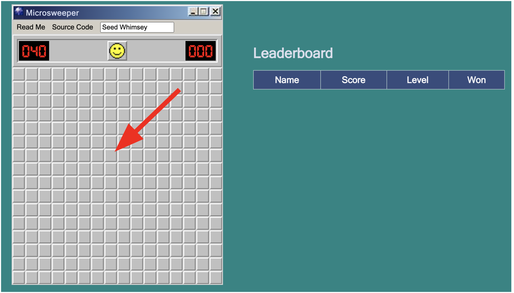

Try playing the mine game! Then you will *scores* in the _Leaderboard_:

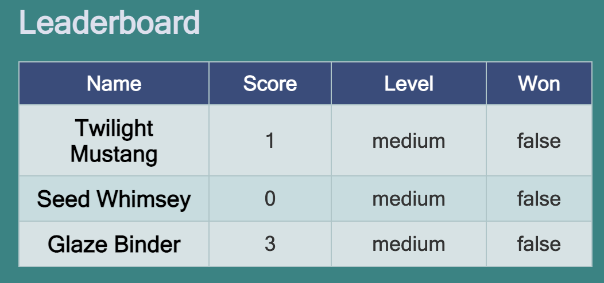

Access the RESTful API (_/api/score_) to get all scores that store in the local PostgreSQL database. Run the following API testing client [HTTPie](https://httpie.io/) command line interface: 

```shell
http :8080/api/scoreboard
```

The output should look like:

```shell
[
    {
        "level": "medium",
        "name": "Twilight Mustang",
        "success": "false",
        "time": "1"
    },
    {
        "level": "medium",
        "name": "Seed Whimsey",
        "success": "false",
        "time": "0"
    },
    {
        "level": "medium",
        "name": "Glaze Binder",
        "success": "false",
        "time": "3"
    }
]
```

Make sure if the scores are actually stored in the local DynamoDB. Go back to the DynamoDB web shell. Then, copy and paste the following code to the shell and run it:

```shell
var dynamodb = new AWS.DynamoDB({
    endpoint: "http://localhost:8000"
});
var tableName = "score";

var params = {
    TableName: tableName,
    Select: "ALL_ATTRIBUTES"
};

function doScan(response) {
    if (response.error) ppJson(response.error); // an error occurred
    else {
        ppJson(response.data); // successful response

        // More data.  Keep calling scan.
        if ('LastEvaluatedKey' in response.data) {
            response.request.params.ExclusiveStartKey = response.data.LastEvaluatedKey;
            dynamodb.scan(response.request.params)
                .on('complete', doScan)
                .send();
        }
    }
}
console.log("Starting a Scan of the table");
dynamodb.scan(params)
    .on('complete', doScan)
    .send();
```

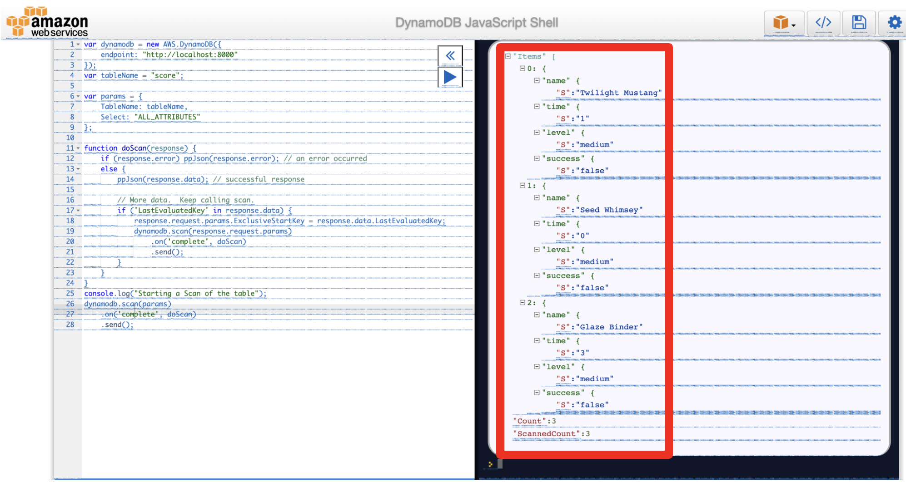

Note that you can use `curl` command line interface to access the RESTful API by `curl localhost:8080/api/scoreboard`.

Stop the Quarkus dev mode by pressing `CTRL-C`.

## 2. Deploy the Quarkus App to  Red Hat OpenShift Service on AWS<a name="DeployQuarkusApp"></a>

Red Hat OpenShift Service on AWS (ROSA) is a [fully-managed](https://cloud.redhat.com/learn/topics/managed-services?hsLang=en-us) and jointly supported Red Hat OpenShift offering that combines the power of Red Hat OpenShift, the industry’s most comprehensive enterprise Kubernetes platform, and the AWS public cloud. 

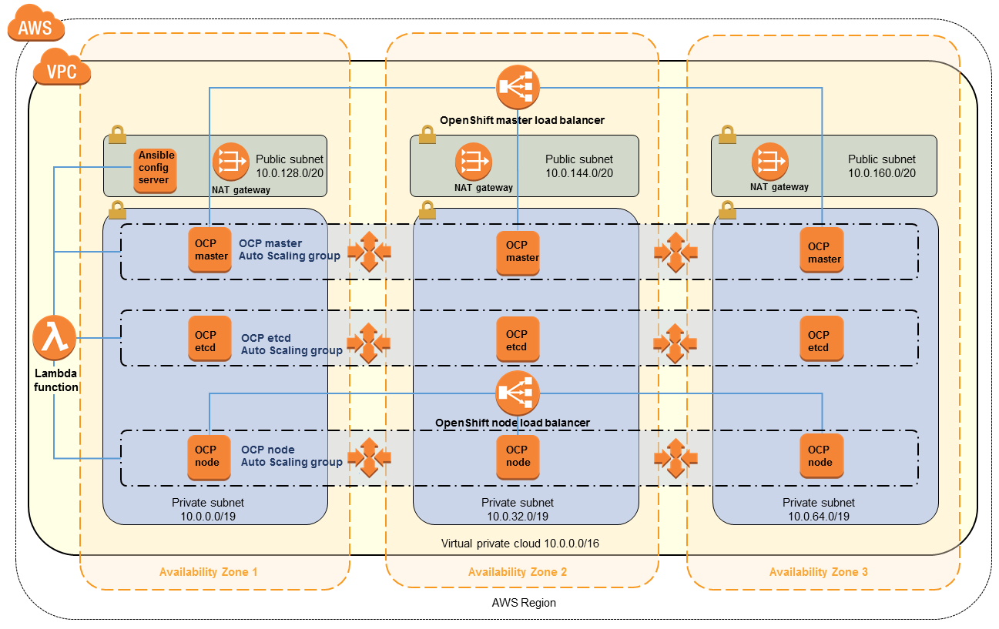

If you haven't installed ROSA cluster with your own AWS account and Red Hat subscription, take a moment to follow up on the below documents: 

* [Sign up for a Red Hat subscription](https://www.redhat.com/wapps/ugc/register.htmlhttps://docs.microsoft.com/en-us/azure/cost-management-billing/manage/create-subscription)
* [Sign up for an AWS account](https://aws.amazon.com/)
* [Installing Red Hat OpenShift Service on AWS](https://docs.openshift.com/rosa/rosa_getting_started/rosa_getting_started_iam/rosa-installing-rosa.html)
* [Creating a ROSA cluster](https://docs.openshift.com/rosa/rosa_getting_started/rosa_getting_started_iam/rosa-creating-cluster.html)

### Create a new Table in Amazon DynamoDB

Let's say that ROSA is our production environment to deploy the Microsweeper application. Also, We need to guarantee _data persistency_ regardless of randomly restarting an application container (_Microsweeper_) on the Kubernetes cluster. 

**Amazon DynamoDB** is a fully managed proprietary NoSQL database service that supports key–value and document data structures. The following guide shows you how to create a single DynamoDB instance on AWS.

[Setting Up DynamoDB (Web Service)](https://docs.aws.amazon.com/amazondynamodb/latest/developerguide/SettingUp.DynamoWebService.html)

Create a new table (`score`) by using the following aws command:

```shell
aws dynamodb create-table --table-name score \
                          --attribute-definitions AttributeName=name,AttributeType=S \
                          --key-schema AttributeName=name,KeyType=HASH \
                          --provisioned-throughput ReadCapacityUnits=1,WriteCapacityUnits=1
```

The output should look like this:

```shell
{
    "TableDescription": {
        "AttributeDefinitions": [
            {
                "AttributeName": "name",
                "AttributeType": "S"
            }
        ],
        "TableName": "score",
        "KeySchema": [
            {
                "AttributeName": "name",
                "KeyType": "HASH"
            }
        ],
        "TableStatus": "CREATING",
        "CreationDateTime": "2022-04-05T23:35:08.044000-04:00",
        "ProvisionedThroughput": {
            "NumberOfDecreasesToday": 0,
            "ReadCapacityUnits": 1,
            "WriteCapacityUnits": 1
        },
        "TableSizeBytes": 0,
        "ItemCount": 0,
        "TableArn": "arn:aws:dynamodb:us-east-2:676892090497:table/score",
        "TableId": "40485fab-9278-44c6-a7c9-90aa9b38ee9d"
    }
}
```

Go to `DynamoDB` > `Tables` in AWS web console, you'll see the new table (_score_).

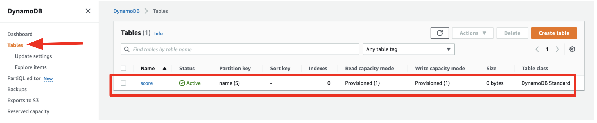

### Deploy a Quarkus App to ROSA<a name="DeployQuarkusApp"></a>

If you haven't already known the OpenShift cluster information, read the following guide.

* [Accessing a ROSA cluster](https://docs.openshift.com/rosa/rosa_getting_started/rosa_getting_started_iam/rosa-accessing-cluster.html)

Log in to the `OpenShift Web Console` using `kubeadmin` or your own user account. Then, create a new project (_microsweeper-quarkus_): 

* Name: microsweeper-quarkus


Quarkus also offers the ability to automatically generate OpenShift resources based on sane default and user supplied configuration. The OpenShift extension is actually a wrapper extension that brings together the [kubernetes](https://quarkus.io/guides/deploying-to-kubernetes) and [container-image-s2i](https://quarkus.io/guides/container-image#s2i) extensions with defaults so that it’s easier for the user to get started with Quarkus on OpenShift.

Add `quarkus-openshift` extension in Terminal:

```shell
quarkus ext add openshift
```

The output should look like this:

```shell
[SUCCESS] ✅  Extension io.quarkus:quarkus-openshift has been installed
```

Quarkus supports the notion of configuration profiles. These allows you to have multiple configurations in the same file and select between then via a profile name.

By default Quarkus has three profiles, although it is possible to use as many as you like. The default profiles are:

* **dev** - Activated when in development mode (i.e. _quarkus:dev_)
* **test** - Activated when running tests
* **prod** - The default profile when not running in development or test mode

**Replace** the `AWS_ACCESS_KEY_ID` and `AWS_SECRET_ACCESS_KEY` variables with your AWS credentials in _src/main/resources/application.properties_:

```yaml
%prod.quarkus.dynamodb.aws.credentials.static-provider.access-key-id=YOUR_AWS_ACCESS_KEY_ID
%prod.quarkus.dynamodb.aws.credentials.static-provider.secret-access-key=YOUR_AWS_SECRET_ACCESS_KEY
```

Before deploying the app to ROSA, be sure to log in to the right project (_microsweeper-quarkus_) via `oc` command line interface.

* [Installing the OpenShift CLI](https://docs.openshift.com/container-platform/4.10/cli_reference/openshift_cli/getting-started-cli.html)

Get the token from OpenShift web consol. Then, paste the `oc login` command-line with the _token_ in Terminal.

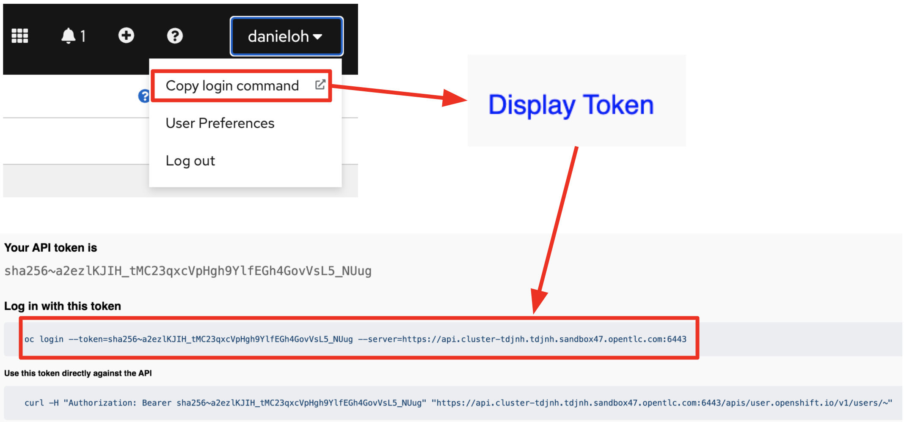

The output should look like this:

```shell
Logged into "https://api.cluster-tdjnh.tdjnh.sandbox47.opentlc.com:6443" as "danieloh" using the token provided.

You have access to 70 projects, the list has been suppressed. You can list all projects with 'oc projects'

Using project "microsweeper-quarkus".
```

Now let’s deploy the application itself. Run the following Quarkus CLI which will build and deploy using the OpenShift extension:

```shell
quarkus build --no-tests
```

The output should end with `BUILD SUCCESS`.

Finally, make sure it’s actually done rolling out:

```shell
oc rollout status -w dc/microsweeper-appservice
```

Wait for that command to report `replication controller microsweeper-appservice-1 successfully rolled out` before continuing.

Go to the `Topology View` in _OpenShift Dev Perspective_, make sure it’s done deploying (dark blue circle):


Click on the Route icon above (the arrow) to access the **Microsweeper** running on ROSA. Then, give it try to play the mine game a few time:

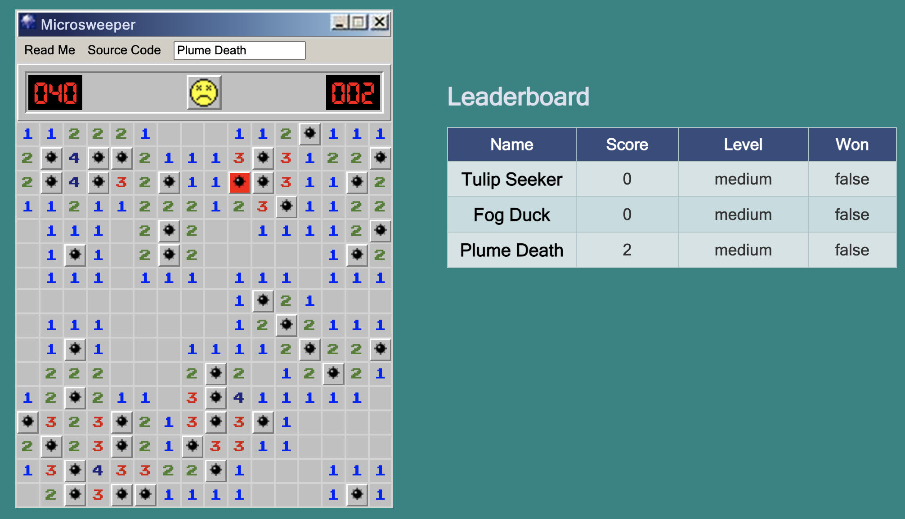

Access the RESTful API (_/api/score_) to get all scores that store in the **Amazon DynamoDB**. You need to replace with your own `ROUTE` url: 

```shell
http http://YOUR-ROUTE-URL/api/scoreboard
```

The output should look like this:

```shell
[
    {
        "level": "medium",
        "name": "Tulip Seeker",
        "success": "false",
        "time": "0"
    },
    {
        "level": "medium",
        "name": "Plume Death",
        "success": "false",
        "time": "2"
    },
    {
        "level": "medium",
        "name": "Fog Duck",
        "success": "false",
        "time": "0"
    }
]
```

### Explore Items in Amazon DynamoDB

Go to **DynamoDB > Tables** then click on `score` table. Click on `Explore table items`. You will the same items as the result of the REST API or the Leaderboard GUI. 

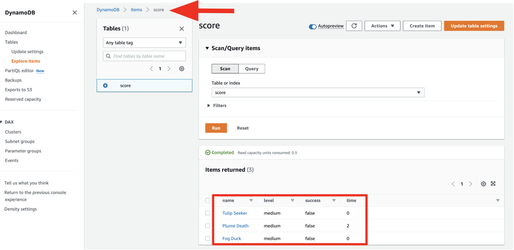

**Great job!** You've successfully deployed the Quarkus app to ROSA with connecting to Amazon DynamoDB instance.

## 3. Integrate with Amazon Simple Email Service<a name="SendSES"></a>

In production, you probably need to stand an email server up for sending a certain information to team members or end-users when an important event happens. In this demo, you've already deployed Java application (_Microsweeper_) to OpenShift on AWS cloud. AWS cloud allows you to use the [Amazon Simple Email Service (SES)](https://aws.amazon.com/ses/) that is a flexible and highly-scalable email sending and receiving service. Using SES, you can send emails with any type of correspondence. You can find more information about SES at [the Amazon SES website](https://aws.amazon.com/ses/).

To send a email via AWS SES, you need to learn how to use the Simple Mail Transfer Protocol (SMTP) interface or the Amazon SES API with the following methods:

* HTTPS requests
* AWS SDK
* Command line interface

Find more information [here](https://docs.aws.amazon.com/ses/latest/dg/send-email-api.html)

However, Quarkus provides a **quarkus-amazon-ses** extension to send emails easily through a flexible and highly-scalable Amazon SES. The Quarkus extension supports two programming models:

* Blocking access using URL Connection HTTP client (by default) or the Apache HTTP Client
* [Asynchronous programming](https://docs.aws.amazon.com/sdk-for-java/v2/developer-guide/basics-async.html) based on JDK’s CompletableFuture objects and the Netty HTTP client.

This deme application has already added the _quarkus-amazon-ses_ dependency in the `pom.xml`.

### Create identity in AWS SES

Before you're sending any email, you must verify `sender` and `recipient` email addresses using [AWS Command Line Interface (CLI)](https://docs.aws.amazon.com/cli/latest/userguide/getting-started-install.html). Use the following commands:

```shell
aws ses verify-email-identity --email-address <sender@email.address>
aws ses verify-email-identity --email-address <recipient@email.address>
```

You can also create an identity then verify it via AWS web console as below:

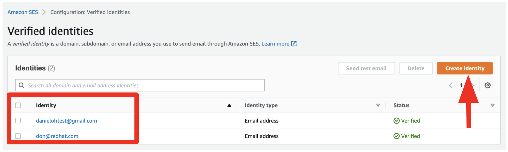

Note that you will receive the verification email from Amazon to complete the email verification. Then, complete the verification.

### Update ScoreboardResource to send emails

**Replace** with your verified email addresses for sender and recipient in `ScoreboardResource.java` file:

```java
    public static final String EMAIL_FROM_ADDRESS = "SENDER_EMAIL_ADDRESS";
    public static final String EMAIL_TO_ADDRESS = "RECIPIENT_EMAIL_ADDRESS";
```

In the same file, **uncomment** the `encrypt(score);` in the _addScore(Score score)_ method. Once you uncomment it, the method should look like this:

```java
    @POST
    @Consumes(MediaType.APPLICATION_JSON)
    public void addScore(Score score) throws Exception {
        scoreboardService.addScore(score);
        encrypt(score);
    }
```

Take a look at the **encrypt** method to understand how Quarkus enables you to send emails to verified recipients through AWS SES. _(Don't copy the following code!_)

```java
    public void encrypt(Score score) {
        logger.info("New receiver: " + score.getName());
        ses.sendEmail(req -> req
            .source(EMAIL_FROM_ADDRESS)
            .destination(d -> d.toAddresses(EMAIL_TO_ADDRESS))
            .message(msg -> msg
                .subject(sub -> sub.data("[" + score.getName() + "] You've got a new score in Microsweeper!"))
                .body(b -> b.text(txt -> txt.data("Congrats!!! " + score.getName() + " is just completed the Microsweeper with " + score.getLevel()))))).messageId();
    }
```

### Update AWS credentials for AWS SES

**Uncomment** the AWS SES configurations. Then, **replace** the `AWS_ACCESS_KEY_ID` and `AWS_SECRET_ACCESS_KEY` variables with your AWS credentials in _src/main/resources/application.properties_:

```yaml
%prod.quarkus.ses.aws.region=us-east-2
%prod.quarkus.ses.aws.credentials.type=static
%prod.quarkus.ses.aws.credentials.static-provider.access-key-id=YOUR_AWS_ACCESS_KEY_ID
%prod.quarkus.ses.aws.credentials.static-provider.secret-access-key=YOUR_AWS_SECRET_ACCESS_KEY
```

### Rebuild and Redeploy the Microsweeper to ROSA

Rebuild the application then deploy it to ROSA by running the following Quarkus CLI:

```shell
quarkus build --no-tests
```

The output should end with `BUILD SUCCESS`.

When the new deployment is completed, go back to the _Microsweeper_ GUI, try to play the game once again. For example, new player is `Quill Heron`!

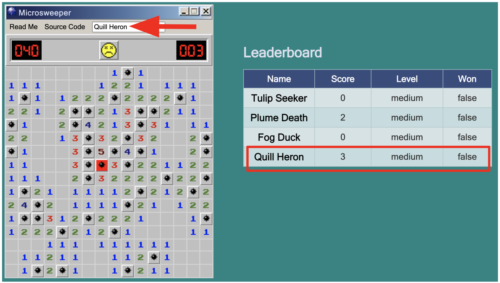

The recipient will get the email in a few minutes from Amazon SES as below example:

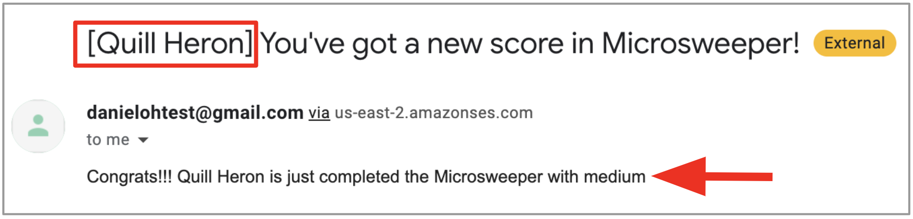

### (Optional) Delete Red Hat OpenShift Service on AWS cluster

In case you need to delete the ROSA cluster for the cost saving after the demo, follow up on this tutorial:

* [Deleting a ROSA cluster](https://docs.openshift.com/rosa/rosa_getting_started/rosa_getting_started_iam/rosa-deleting-cluster.html)